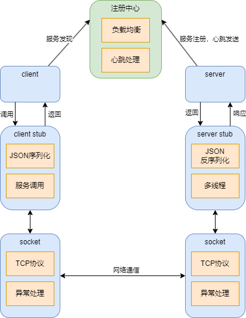

# rpc
RPC框架图  
   
## 执行过程
### 启动注册中心  
`python register_center.py`  
### 启动服务端  
#### 启动参数（支持ipv4与ipv6）  
`python server_main.py -l 192.168.33.236 -p 5444`    
`python server_main.py -l fe80::3b3b:5a11:9f7d:3ece%22 -p 2425`  
#### 连接到注册中心并注册本地函数（自动执行）  
#### 注册后等待客户端的连接与处理请求（无需操作）  
#### 若需要退出服务器，输入  
`exit`  
### 启动客户端  
#### 启动参数  
`python client_main.py -s`  
#### 服务使用  
启动后会自动连上注册中心，注册中心会发送给客户端一个当前在注册中心注册过的、且服务端心跳仍然存活的函数清单，客户端可以选择需要调用的函数，若不需要使用客户端，输入exit可以退出  
例如我们希望调用add_num函数，我们输入add_num后，注册中心会返回一个支持add_num的服务器的ip和端口号，客户端收到后会自动连接到该服务器。随后我们需要分别输入该函数所需参数，所有参数输入完毕后输入exit结束输入，（例如add_num函数作用为返回两个参数之和，我们输入两个加数）之后服务器会返回调用结果，然后自动与客户端断开连接，服务器可继续进行下一个方法的调用  
若输入参数不足、格式不正确，会触发异常，客户端程序退出，服务器正常运行（若输入多余参数，程序会无视多余参数）
## 退出客户端  
`exit`  
